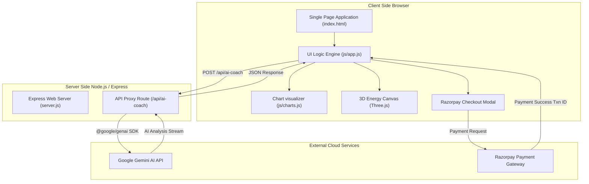
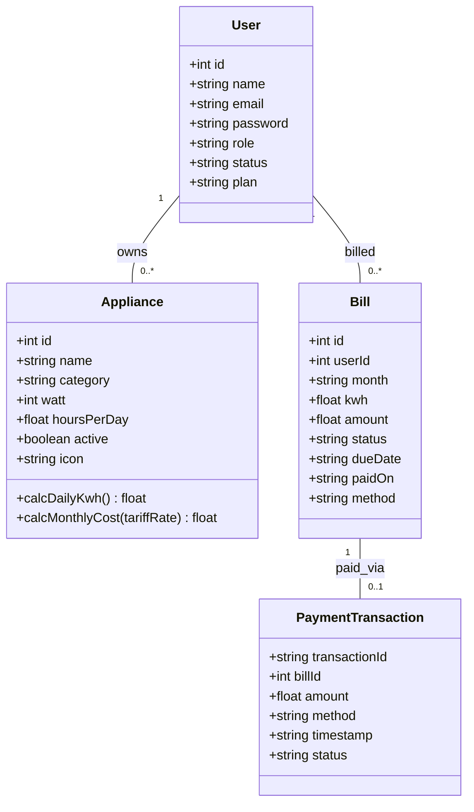

# ⚡ ELECTYRO — Be Wise With Your Watts

> *"Creativity is intelligence having fun — and sustainability is intelligence caring for tomorrow."*  
> — **Albert Einstein** *(adapted)*

---

[](https://opensource.org/licenses/MIT)
[](https://nodejs.org/)
[](https://expressjs.org/)
[](https://tailwindcss.com/)
[](https://www.chartjs.org/)
[](https://threejs.org/)
[](https://razorpay.com/)
[](https://deepmind.google/technologies/gemini/)

---

## 📌 Project Overview

**ELECTYRO** is an intelligent, full-stack smart energy management and electricity billing platform. It empowers homeowners, business operators, and utility administrators to track real-time appliance power consumption, analyze multi-month energy trends, consult an AI Energy Coach powered by **Google Gemini**, and pay utility bills seamlessly using an authentic **Razorpay Payment Gateway**.

### ✨ Highlights & Core Capabilities

- 🔌 **1. Appliance-Wise Electricity Tracking**
  - Real-time active power draw (Watts/kW) monitoring.
  - Interactive daily runtime adjustment controls (+/- hours per day).
  - Categorized breakdown (Cooling, Heating, Kitchen, Lighting, Entertainment).
  - Automated calculation of house load share (%) and estimated monthly electricity cost.

- 📊 **2. Multi-Month Energy Consumption Analytics**
  - Comparative bar & doughnut chart visualizers powered by **Chart.js**.
  - Historical energy tracking across recent months (May, June, July).
  - Automatic detection and spotlighting of top energy-consuming devices (e.g. Air Conditioner).
  - Energy slab & tariff cost analysis.

- 🤖 **3. Gemini AI Energy Coach**
  - AI assistant integrated via `@google/genai` TypeScript SDK.
  - Server-side API endpoint (`/api/ai-coach`) shielding sensitive credentials.
  - Context-aware recommendations for reducing energy bills and optimizing high-load appliances.

- 💳 **4. Razorpay Payment Gateway Integration**
  - Authentic Checkout modal supporting **UPI / QR Code**, **Credit/Debit Cards**, **Net Banking**, and **Wallets**.
  - Express transaction authorization with instant verification status.
  - Animated pulsing success badge with confetti celebration.
  - Itemized transaction receipt display and downloadable PDF receipts.

- 🌐 **5. Interactive 3D Energy Mesh Visualizer**
  - Real-time WebGL rendering powered by **Three.js**.
  - Dynamic orbital visualizer representing household energy flow grid.

- 👥 **6. Multi-Role Management System**
  - **Consumer Portal**: Personal energy stats, bill payments, appliance toggles.
  - **Staff Portal**: Meter readings, bill generation, payment logs.
  - **Admin Portal**: User management, tariff rate configuration, system logs.

---

## 🛠️ Tech Stack & Dev Tools

### **Frontend & User Interface**
- **HTML5 & CSS3**: Custom dark-mode glassmorphic styling, responsive flexbox/grid layouts.
- **Tailwind CSS**: Utility-first CSS library for layout, typography, and state colors.
- **FontAwesome 6.5**: High-definition iconography.
- **Google Fonts**: *Plus Jakarta Sans* and *Outfit* font pairings.

### **Data Visualization & Graphics**
- **Chart.js (v4.x)**: Canvas-based responsive charting library (Line, Bar, Doughnut).
- **Three.js (v0.185)**: WebGL 3D rendering library for interactive grid visualizers.

### **Backend & APIs**
- **Node.js**: Modern JavaScript/TypeScript runtime.
- **Express.js (v4.19)**: High-performance web server handling static assets and API routes.
- **@google/genai SDK**: Official Google Gemini AI SDK for intelligence queries.

### **Payment & Integrations**
- **Razorpay Checkout SDK (`v1`)**: Secure client-side checkout modal.

### **Development Tools**
- **Git & GitHub**: Version control and source code management.
- **Render / Cloud Run**: Cloud container hosting platform.
- **NPM**: Package dependency manager.

---

## 📁 Project Folder Structure

```text
electyro/
│
├── css/
│   └── styles.css              # Custom styling, dark glassmorphic UI, animations, Razorpay modal
├── js/
│   ├── app.js                  # Main application UI controller, routing, and Razorpay payment flow
│   ├── charts.js               # Chart.js initialization and multi-month analytics rendering
│   └── db.js                   # Mock database, initial appliance state, and user records
├── components/                 # Reusable UI component modules
├── .env.example                # Template for server environment variables
├── index.html                  # Core HTML single-page application entry point
├── metadata.json               # Platform configuration metadata
├── package.json                # Project dependencies and npm scripts
├── server.js                   # Express server and Gemini AI proxy backend endpoint
└── README.md                   # Complete documentation guide
```

---

## 🏗️ System Architecture Diagram



---

## 🧬 Data Model / Class Diagram



---

## 🚀 Installation & Local Setup

1. **Clone the repository:**
   ```bash
   git clone https://github.com/your-username/electyro.git
   cd electyro
   ```

2. **Install dependencies:**
   ```bash
   npm install
   ```

3. **Configure Environment Variables:**
   Create a `.env` file or copy `.env.example`:
   ```bash
   cp .env.example .env
   ```
   Add your optional Google Gemini API key:
   ```env
   GEMINI_API_KEY=your_gemini_api_key_here
   PORT=3000
   ```

4. **Start the local server:**
   ```bash
   npm start
   ```
   Open `http://localhost:3000` in your browser.

---

## 🌐 Deploying to Render

1. Create a new **Web Service** on [Render.com](https://render.com).
2. Connect your GitHub repository.
3. Set the following settings:
   - **Environment**: `Node`
   - **Build Command**: `npm run build` *(or leave as default)*
   - **Start Command**: `npm start`
4. Under **Environment Variables**, set:
   - `GEMINI_API_KEY`: *(Your Google Gemini API Key)*
   - `PORT`: *(Render automatically sets this)*
5. Click **Deploy Web Service**!

---

## 👨‍💻 Author & Credits

**Developed with 💡 and ⚡ by:**

- **Sakthi Ganesh** — Lead Architect & Developer  
  - Email: `sgkan24@gmail.com`
  - Project: ELECTYRO Smart Energy Management

---

*“Be Wise With Your Watts — Save Energy, Empower Tomorrow.”*

